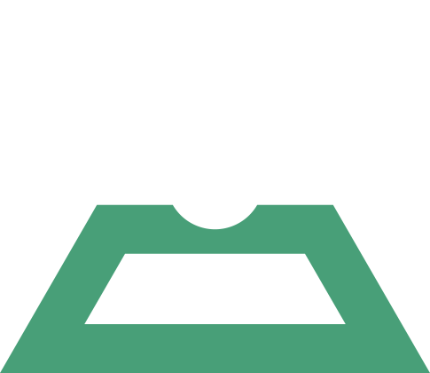

<!-- _coverpage.md -->

# vuelluminati <small>beta</small>

> Estrutura para projetos escaláveis com Vue.js

* Fácil adaptação
* Linha de comando
* Escalável

[GitHub](https://github.com/danielbonifacio/vuelluminati/)
[Quickstart](#iniciando)

